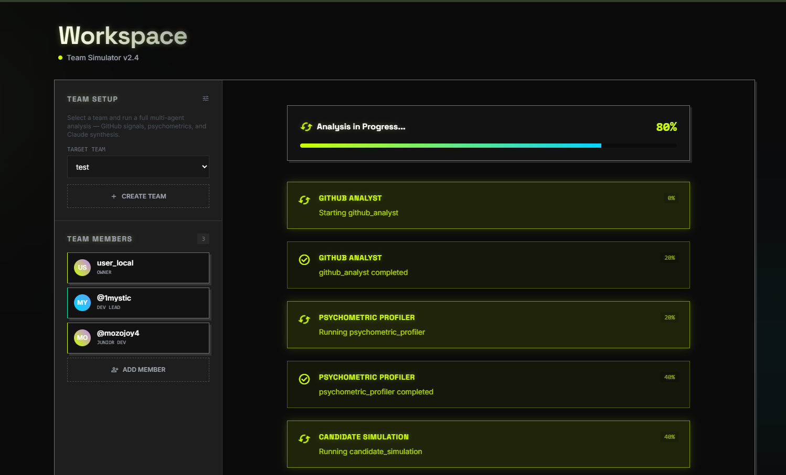
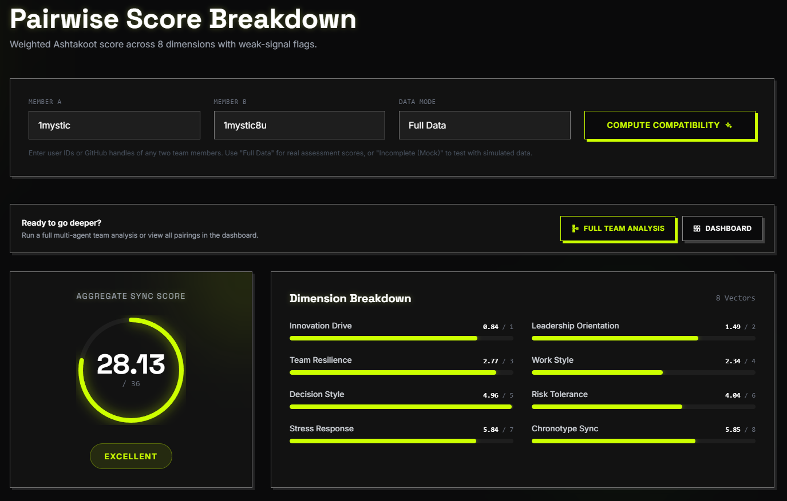
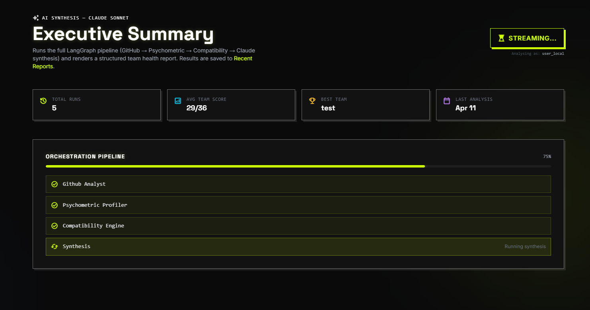

# GitSyntropy


> ## **Predict how well developers will work together, before they do.**

GitSyntropy is a multi-agent system that scores team compatibility and simulates hiring impact using GitHub behavioral data and psychometric profiling. It surfaces concrete risks and recommendations, not just raw metrics and numbers.

---

## Demo

### Dashboard : run the full analysis pipeline


### Workspace : adaptive psychometric profiling



### Compatibility : pairwise score breakdown



### Insights : Claude synthesis report streaming



---

## The Problem

Engineering teams fail due to misalignment in work patterns, communication styles, and decision-making : not lack of technical skill. Existing tools like MBTI and DISC rely on self-report surveys that are subjective, static, and disconnected from real work behavior.

GitSyntropy derives compatibility signals from what engineers actually do: commit timing, PR activity, collaboration frequency, and self-assessed behavioral dimensions. It produces a continuously-updatable model of how a team is likely to function together.

---

## What It Does

**Team health check**
Input GitHub usernames. Get a compatibility score, dimension-level breakdown, and flagged risks.

**Hiring decision support**
Simulate adding a candidate to the current team. See whether the score improves and which friction points get resolved.

**Async optimization**
Detect chronotype gaps between team members. Recommend working models based on peak-hour overlap and collaboration index.

---

## Example Output

```
Team: atlas-core (4 members)

Compatibility Score:  24.3 / 36   (Good)

Dimension Breakdown:
  Chronotype Sync       6 / 8     WARNING -- 6h peak-hour gap
  Stress Response       6 / 7     OK
  Risk Tolerance        4 / 6     OK
  Decision Style        3 / 5     WARNING -- high variance
  Work Style            4 / 4     OK
  Team Resilience       1 / 3     LOW
  Leadership Spread     1 / 2     OK
  Innovation Drive      0 / 1     OK

Risks:
  - Chronotype mismatch: synchronous standups will be low-quality
  - Decision style variance: likely friction under deadline pressure

Recommendations:
  - Shift to async-first workflow
  - Target hire profile: early bird, low risk tolerance, structured thinker
```

**Hire simulation**

```
Current score:        24.3 / 36
With candidate X:     29.1 / 36   (+20%)

Candidate resolves:   Chronotype mismatch, resilience gap
Candidate introduces: Minor leadership overlap (acceptable)
```

---

## Architecture

```
GitHub API
    |
    v
GitHub Analyst Agent        -- commit patterns, PR activity, chronotype extraction
    |
    v
Psychometric Profiler       -- 8-dimension behavioral profile from adaptive assessment
    |
    v
Compatibility Engine        -- variance-based weighted scoring across 8 dimensions
    |
    v
Monte Carlo Simulator       -- candidate hire impact simulation (N iterations)
    |
    v
Synthesis Agent (Claude)    -- narrative report: risks, recommendations, hiring gaps
    |
    v
WebSocket stream -> Frontend (Astro + React)
```

**Backend:** FastAPI (async), SQLAlchemy + asyncpg, Supabase (PostgreSQL), LangGraph orchestration
**Frontend:** Astro, React, Tailwind CSS, Framer Motion, recharts
**AI:** Anthropic Claude (streaming synthesis), LangGraph multi-agent pipeline
**Infra:** Railway (backend), Vercel (frontend), GitHub Actions CI/CD

---

## Skills Demonstrated

**ML and statistical modeling**
- Variance-based weighted scoring model across 8 behavioral dimensions
- Monte Carlo simulation for hire impact prediction (configurable iteration count)
- Behavioral feature engineering from raw GitHub telemetry

**Data engineering**
- GitHub API ingestion pipeline with rate-limit handling
- Feature extraction: commit timestamp distributions, PR merge patterns, collaboration index
- Chronotype derivation from commit activity heatmaps

**System design**
- Multi-agent orchestration via LangGraph with step-level streaming
- WebSocket-based real-time pipeline progress to the frontend
- Computerized Adaptive Testing (CAT) algorithm for psychometric assessment

**Backend engineering**
- FastAPI async API with session-mode PostgreSQL (not pooler) via asyncpg
- GitHub OAuth 2.0 flow with JWT session management
- SQLAlchemy async ORM, Alembic-ready schema

**Frontend engineering**
- Astro islands architecture with selective React hydration
- nanostores for cross-island shared state
- Framer Motion page and card animations with AnimatePresence

---

## Compatibility Scoring Model

The engine scores 8 behavioral dimensions derived from the assessment and GitHub signals. Each dimension carries a weight (1-8) calibrated so that high-stakes alignment factors (chronotype, stress response) contribute more to the total.

Scores reflect not just averages but variance -- two team members with opposite profiles on a high-weight dimension trigger a risk flag even if the mean score is acceptable. This variance sensitivity is what separates the model from a naive sum.

Maximum possible score: 36 points.

---

## Local Setup

### Backend

```bash
cd apps/backend
python -m venv .venv
.venv\Scripts\activate          # Windows
pip install -e ".[dev]"
cp .env.example .env            # fill in Supabase URL, Anthropic key, GitHub OAuth
uvicorn app.main:app --reload --port 8000
```

Required `.env` values:

```
GS_DATABASE_URL=postgresql+asyncpg://...    # Supabase direct connection, port 5432
GS_ANTHROPIC_API_KEY=sk-ant-...
GS_GITHUB_CLIENT_ID=...
GS_GITHUB_CLIENT_SECRET=...
GS_JWT_SECRET=...                           # any strong random string
```

### Frontend

```bash
cd apps/frontend
npm install
npm run dev                                 # starts on http://localhost:4321
```

Frontend reads `PUBLIC_API_URL` from `.env` (defaults to `http://localhost:8000`).

---

## Project Structure

```
GitSyntropy/
  apps/
    backend/
      app/
        main.py         -- FastAPI routes
        services.py     -- business logic, agent calls, scoring
        database.py     -- async engine, session factory
        models.py       -- SQLAlchemy ORM models
        schemas.py      -- Pydantic request/response schemas
        config.py       -- env-based settings (pydantic-settings)
    frontend/
      src/
        components/     -- React island components (Dashboard, Assessment, etc.)
        lib/            -- API client, nanostores, motion variants
        pages/          -- Astro pages (SSR shell + React hydration)
  .github/
    workflows/
      deploy.yml        -- Railway (backend) + Vercel (frontend) deployment
```

---

## Deployment

Backend deploys to Railway, frontend to Vercel. Both trigger on push to `main`.

GitHub Actions secrets required:

| Secret | Where to get it |
|---|---|
| `RAILWAY_TOKEN` | Railway dashboard -- Account -- Tokens |
| `PUBLIC_API_URL_PROD` | Your Railway service URL |
| `BACKEND_URL` | Same as above (used for health checks) |
| `VERCEL_TOKEN` | Vercel dashboard -- Account -- Tokens |
| `VERCEL_ORG_ID` | Vercel project settings |
| `VERCEL_PROJECT_ID` | Vercel project settings |

Backend environment variables (set in Railway dashboard, not GitHub secrets):
`GS_DATABASE_URL`, `GS_ANTHROPIC_API_KEY`, `GS_GITHUB_CLIENT_ID`, `GS_GITHUB_CLIENT_SECRET`, `GS_JWT_SECRET`

---

## Status

Core pipeline functional: GitHub sync, adaptive assessment, compatibility scoring, Monte Carlo simulation, Claude synthesis, WebSocket streaming.

In progress: production OAuth callback URL configuration, hire simulation UI on the compatibility page.
