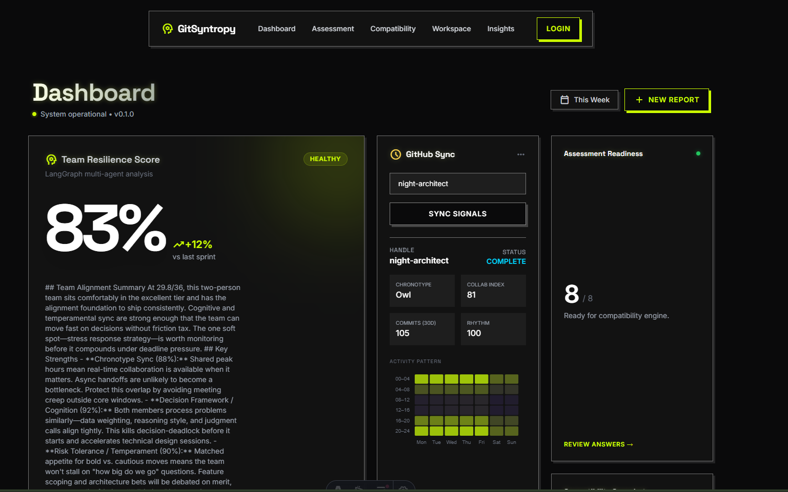

Project: GitSyntropy backend. Resume from 2026-04-09 session.

Completed last session: F1 DB layer, F3 GitHub Analyst (K-Means), F4 Claude streaming, F5 WebSocket streaming. Windows 2+3 finished F6 (dashboard: RadarChart, ChronotypeHeatmap, DashboardClient, InsightsClient) and F7 (team management CRUD + WorkspaceClient).

FIRST — two setup tasks before anything else:
1. Ask me for the Supabase pooler connection string (I'll get it from Dashboard → Settings → Database → Connection string → URI). Update GS_DATABASE_URL in apps/backend/.env.
2. Test DB: cd apps/backend && .venv/Scripts/python -c "import asyncio; from app.database import engine, Base; from app import models; asyncio.run(engine.begin().__aenter__().run_sync(Base.metadata.create_all))"
3. Start server: .venv/Scripts/uvicorn app.main:app --reload and confirm GET /api/v1/health returns 200.

Then build in order:
- Feature 2: Test real GitHub OAuth flow end-to-end (app is configured — Iv23li7hELkVsoXUxaN8)
- Feature 8: CAT assessment branching + Monte Carlo candidate simulation (1000 iterations) in services.py
- Feature 9: Error handling, rate limiting (slowapi), pytest suite ≥80% coverage
- Feature 10: apps/backend/railway.toml, apps/frontend/vercel.json, .github/workflows/ci.yml

Working dir: g:\synced-pc\1_Work\projects\GitSyntropy
Stack: FastAPI + LangGraph + SQLAlchemy async + asyncpg + Anthropic SDK + PyGithub
Key files: apps/backend/app/main.py, services.py, models.py, github_client.py, claude_client.py

---
Project: GitSyntropy frontend. Features 6 (dashboard) and 7 (team management) are complete.

Check current state of the components, then build:
1. Error boundaries on all React islands (DashboardClient, AssessmentClient, InsightsClient, WorkspaceClient) — show retry button on API errors
2. Loading skeletons while data fetches (replace blank states)
3. Wire team selection into DashboardClient: when user picks a team in WorkspaceClient, run analysis with that team_id
4. AssessmentClient — add score explanation screen after submit (show dimension scores with labels)
5. Auth flow polish — after GitHub OAuth callback, redirect to /workspace (not /dashboard)

Working dir: g:\synced-pc\1_Work\projects\GitSyntropy\apps\frontend
Backend expected at: http://localhost:8000/api/v1

CompatibilityClient.tsx:158 Uncaught TypeError: Cannot convert undefined or null to object
    at Object.keys (<anonymous>)
    at CompatibilityClient (CompatibilityClient.tsx:158:73)
installHook.js:1 The above error occurred in the <CompatibilityClient> component:

    at CompatibilityClient (http://localhost:4321/src/components/CompatibilityClient.tsx:52:33)

Consider adding an error boundary to your tree to customize error handling behavior.
Visit https://reactjs.org/link/error-boundaries to learn more about error boundaries.
chunk-RPCDYKBN.js?v=e06f16e4:19413 Uncaught TypeError: Cannot convert undefined or null to object
    at Object.keys (<anonymous>)
    at CompatibilityClient (CompatibilityClient.tsx:158:73)

WorkspaceClient.tsx:704 Uncaught TypeError: Cannot read properties of undefined (reading 'replace')
    at WorkspaceClient.tsx:704:43
    at Array.map (<anonymous>)
    at WorkspaceClient (WorkspaceClient.tsx:674:27)
installHook.js:1 The above error occurred in the <WorkspaceClient> component:

    at WorkspaceClient (http://localhost:4321/src/components/WorkspaceClient.tsx:57:29)

Consider adding an error boundary to your tree to customize error handling behavior.
Visit https://reactjs.org/link/error-boundaries to learn more about error boundaries.
chunk-RPCDYKBN.js?v=e06f16e4:19413 Uncaught TypeError: Cannot read properties of undefined (reading 'replace')
    at WorkspaceClient.tsx:704:43
    at Array.map (<anonymous>)
    at WorkspaceClient (WorkspaceClient.tsx:674:27)

